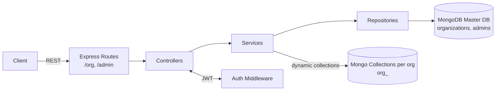

# Organization Management Service (Express + MongoDB)

## Setup
- Install dependencies: `npm install`
- Copy env: `cp env.example .env` (fill `MONGO_URI`, `MASTER_DB`, `JWT_SECRET`, `PORT`)
- Run dev server: `npm run dev`
- Run production: `npm start`

## Endpoints
- `POST /org/create` — `{ organization_name, email, password }`
- `GET /org/get?organization_name=Acme`
- `PUT /org/update` — `{ organization_name, new_name, email, password }`
- `DELETE /org/delete?organization_name=Acme` — requires `Authorization: Bearer <token>`
- `POST /admin/login` — `{ email, password }` → `{ access_token }`

## Notes
- Master DB collections: `organizations`, `admins`
- Per-org collection name: `org_<slug>`
- Rename copies data into a new collection then drops the old one.

## High-Level Diagram

## Architecture & Scalability Notes
- This architecture is straightforward and scales horizontally for small-to-mid multi-tenant needs; stateless app + Mongo connection pooling works well behind a load balancer.
- Per-organization collections keep data grouped and simplify isolation; for very many tenants, collection counts can grow and increase metadata overhead.
- Alternative: per-organization databases improve isolation and backup/archival workflows but add connection/admin overhead; shared tables with tenant_id simplify ops but need strict row-level filtering and indexing.
- Mongo suits schemaless, fast iteration; for strict schemas/transactions, consider PostgreSQL with row-level security or schema-per-tenant.
- Rename flow copies then drops collections—simple but O(data). If allowed, `renameCollection` is faster and atomic at the namespace level; for large data, do background copy or use aggregation `$out`.
- Add indexes: unique on `organizations.organization_name`, `admins.email`; consider TTL/archival per tenant as data grows.
- Security: rotate JWT secret, add refresh tokens, enforce HTTPS, and store secrets outside code.

